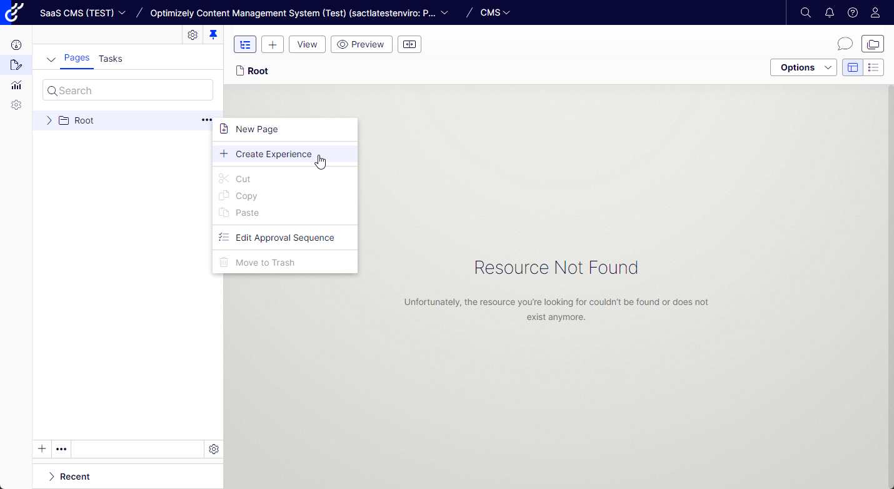
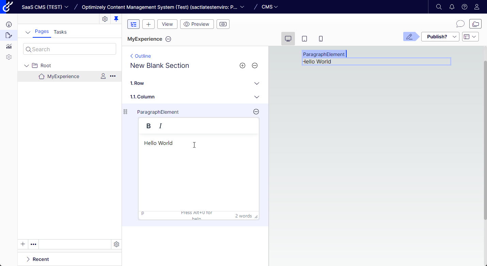
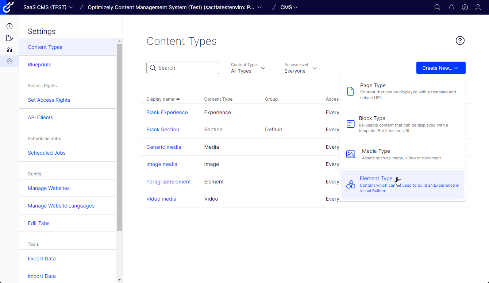
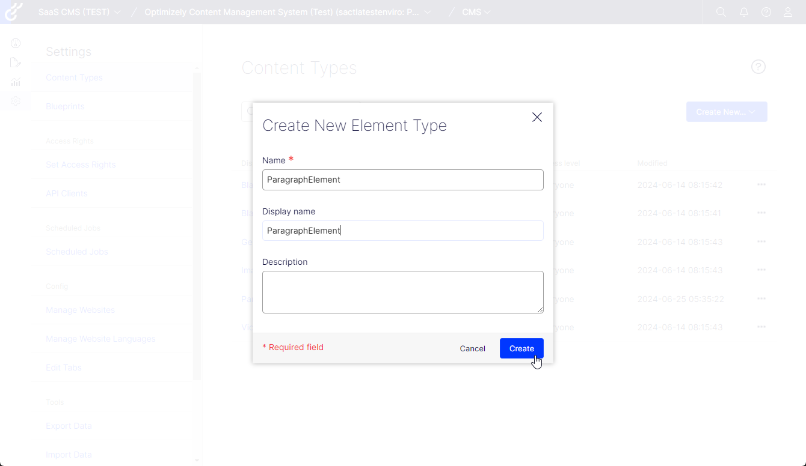
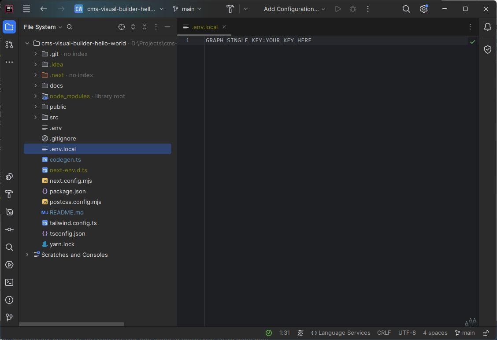

# Visual Builder Hello World example

## How to use Visual Builder in CMS (SaaS)

This repository contains a Hello World example of the Optimizely Visual Builder.
Ensure you have a running an Optimizely CMS (SaaS) instance. For more information on CMS (SaaS) see the [developer documentation](https://docs.developers.optimizely.com/content-management-system/v1.0.0-CMS-SaaS/docs/overview-of-cms-saas) or [end-user documentation](https://support.optimizely.com/hc/en-us/categories/27676671778061).

If you have an empty CMS instance, and you want to see how it all
works go to your CMS (SaaS) instance and:

1. Go to **Settings** > **Content Types**.
2. Click **Create New** and select **Element Type** from the drop-down list.
3. Enter _ParagraphElement_ for the **Name** and **Display name** fields.
4. Click **Create**. 
5. Click **Add Property** and select **Text** from the drop-down list.
6. Enter _Text_ for the **Name** in the **Configure Property** page.
7. Click on the **Text Type** drop-down menu and select **XHTML string (>255)**.
8. Click **Save**.

Then in order to run the sample you need to do the following:

1. Clone this repository.
2. Create a new file, named `.env.local`. 
3. From the Optimizely CMS (SaaS) dashboard, copy the `Single key` from the **Render Content** section.
4. In the `.env.local` file, enter "GRAPH_SINGLE_KEY=" and paste your `Single key` from step 3.
5. In the `.env.local` file, enter "CMS_URL=" and paste your `CMS` url, for example `app-mysuperapp.cms.optimizely.com`
6. Run `yarn install`.
7. Run `yarn codegen` to generate graphql queries.
8. Run `yarn dev` to start the site. It will run on `https://localhost`

Now go to `Edit Mode` and create a new experience of `Blank Experience` type.



Type in the name and hit `Create Experience`.


If you would like to see the site preview in Edit Mode of your SaaS instance
you will need to configure it in `Settings`.


Add a new website pointing to your local nextjs application running on `https://localhost:3000`.
It should look like this:


Now go back to `Edit Mode` and to your `MyExperience`.
Please add a new section, row, column and an element of `Paragraph Type`.

Fill in the text `Hello world!` and you should see it in the preview.



## A detailed process of creating this sample Hello World app

All parts of this repository are described step by step so if you prefer to build stuff yourself
then please find the instructions below. 

### Prerequisites

We are going to create a simple Next.js app which will consume data from our SaaS instance

Let's create a new Next.js application based on the `hello world` example template
> npx create-next-app@latest vb-test --use-yarn --example hello-world vb-test

Let's add graphql support by installing the following dependencies:
> yarn add @apollo/client graphql

Now we need to install development tools which will generate objects based on your graphql schema.
> yarn add --dev @graphql-codegen/cli @graphql-codegen/client-preset @parcel/watcher

Now let's add a configuration file for the codegen plugin. Please create a new file in the root folder `codegen.ts` 
and paste the following code:

```ts
import { CodegenConfig } from "@graphql-codegen/cli";
import { loadEnvConfig } from "@next/env";

loadEnvConfig(process.cwd());

const graphUrl = process.env.GRAPH_URL
const graphSingleKey = process.env.GRAPH_SINGLE_KEY

const config : CodegenConfig = {
    schema: `https://${graphUrl}/content/v2?auth=${graphSingleKey}`,
    documents: ["src/**/*.{ts,tsx}"],
    ignoreNoDocuments: true,
    generates: {
        './src/graphql/': {
            preset: 'client',
            plugins: [],
        }
    }
}

export default config
```

We now need to add a new script to package.json

> "codegen": "graphql-codegen --watch"

This script will generate types based your graphql schema.

### Adding element type 

Before we run the codegen let's add a simple Element type to our SaaS CMS instance. 
Please open `Settings` and `Content types` screen.

Click on `Create New...` menu item and choose `Element type` option.


Fill in the name and display name and hit the `Create` button.


You will see an empty list of properties, hit the `Add property` button and add a single `Text` `XHTML string` property:


After that you should see the newly created element type in the list.


### Graphql generation

Now let's go back to our Next.js application and let's try to run the codegen script.
First you will need to fill in your GRAPH_SINGLE_KEY into `.env.local` file (create it if it does not exist)



> yarn codegen

You should see that it successfully generated the schema to `src/graphql` folder:


After that `src/graphql` should contain a few files which will let you write graphql queries.

### Adding first element component

Let's create a new React component which will display our `ParagraphElement`.

The code will be something like this:

```tsx
import { FragmentType, useFragment } from '../../graphql/fragment-masking'
import { graphql } from '@/graphql'

export const ParagraphElementFragment = graphql(/* GraphQL */ `
    fragment paragraphElement on ParagraphElement {
        Text {
            html
        }
    }
`)

const ParagraphElementComponent = (props: {
    paragraphElement: FragmentType<typeof ParagraphElementFragment>
}) => {
    const paragraphElement = useFragment(ParagraphElementFragment, props.paragraphElement)
    // @ts-ignore
    return <div dangerouslySetInnerHTML={{ __html: paragraphElement.Text?.html }}></div>
}

export default ParagraphElementComponent
```

### Adding the layout component

Now we need the master component which will be responsible for rendering the layout (sections/row/columns):

```tsx
import React, { FC, useEffect } from 'react'
import { useQuery } from '@apollo/client'

import { graphql } from '@/graphql'
import CompositionNodeComponent from './CompositionNodeComponent'
import { onContentSaved } from "@/helpers/onContentSaved";

export const VisualBuilder = graphql(/* GraphQL */ `
query VisualBuilder($key: String, $version: String) {
  _Experience(where: {
      _metadata: { key: { eq: $key } }
      _or: { _metadata: { version: { eq: $version } } }
    }) {
    items {      
      composition {
            grids: nodes {
              ... on CompositionStructureNode {
                key
                rows: nodes {
                  ... on CompositionStructureNode {
                    key
                    columns: nodes {
                      ... on CompositionStructureNode {
                        key
                        elements: nodes {
                          ...compositionElementNode
                        }
                      }
                    }
                  }
                }
              }
            }
          }
      _metadata {
        key
        version,        
      }
    }
  }
}
`)

interface VisualBuilderProps {
    key?: string;
    version?: string;
}

const VisualBuilderComponent: FC<VisualBuilderProps> = ({ key, version }) => {
    const variables: Record<string, unknown> = {};
    if (version) {
        variables.version = version;
    }

    if (key) {
        variables.key = key;
    }

    const { data, refetch } = useQuery(VisualBuilder, { variables: variables });

    useEffect(() => {
        onContentSaved(_ => {
            refetch();
        })
    }, []);

    const experiences = data?._Experience?.items;
    if (!experiences) {
        return null;
    }

    const experience: any = experiences[experiences.length - 1];

    if (!experience) {
        return null;
    }

    return (
        <div className="relative w-full flex-1 vb:outline">
            <div className="relative w-full flex-1 vb:outline">
                {experience?.composition?.grids?.map((grid: any) =>
                    <div key={grid.key} className="relative w-full flex flex-col flex-nowrap justify-start vb:grid"
                         data-epi-block-id={grid.key}>
                        {grid.rows?.map((row: any) =>
                            <div key={row.key} className="flex-1 flex flex-row flex-nowrap justify-start vb:row">
                                {row.columns?.map((column: any) => (
                                    <div className="flex-1 flex flex-col flex-nowrap justify-start vb:col" key={column.key}>
                                        {column.elements?.map((element: any) =>
                                            <div data-epi-block-id={element?.key} key={element?.key}>
                                                <CompositionNodeComponent compositionElementNode={element}/>
                                            </div>
                                        )}
                                    </div>
                                ))}
                            </div>)}
                    </div>
                )}
            </div>
        </div>
    )
}

export default VisualBuilderComponent
```

It's basically a nested loop on a few levels. First we iterate over sections, then rows, then columns and finally elements.
We are wrapping each of those layout items into basic tailwind grid classes.

In this simple example there is just one element type but we don't want to hardcode anything so here is a pattern 
that you can use to use a different element component per `nodeType`:

```tsx
import { FragmentType, useFragment } from '../../graphql/fragment-masking'
import { graphql } from '@/graphql'
import ParagraphElementComponent from '../elements/ParagraphElementComponent'

export const CompositionElementNodeFragment = graphql(/* GraphQL */ `
    fragment compositionElementNode on CompositionElementNode {
        key
        element {
            _metadata {
                types
            }
            ...paragraphElement
        }
    }
`)

const CompositionElementNodeComponent = (props: {
    compositionElementNode: FragmentType<typeof CompositionElementNodeFragment>
}) => {
    const compositionElementNode = useFragment(CompositionElementNodeFragment, props.compositionElementNode)
    const element = compositionElementNode.element
    switch (element?.__typename) {
        case "ParagraphElement":
            return <ParagraphElementComponent paragraphElement={element}/>
        default:
            return <>NotImplementedException</>
    }
}

export default CompositionElementNodeComponent
```

As you can see based on `element.__typename` we can use different components - in our
example we will use `ParagraphElementComponent`.

### Subscribing to content changes

You need to subscribe to a special event in order to know once content has been updated.

In this repo the subscription is already done in [onContentSaved.ts](src%2Fhelpers%2FonContentSaved.ts)

```ts
epi.subscribe("contentSaved", function (message: ContentSavedEventArgs) {
    // your code here
});
```

More details here:
https://docs.developers.optimizely.com/content-management-system/v1.0.0-CMS-SaaS/docs/enable-live-preview#refresh-the-applications-view-when-content-has-changed
